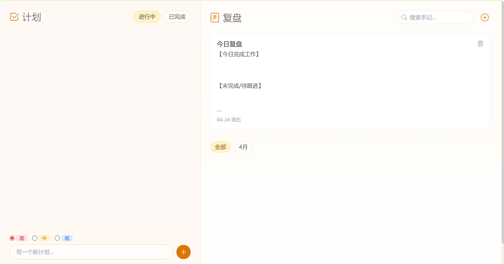

# double-notes
一个简洁的计划与手记管理应用。
本项目为纯静态项目，双击打开 index.html 即可运行。

# 📖 计划+复盘

> 一个简洁、优雅的纯原生 JavaScript 单页应用，用于管理日常计划和工作复盘。

# 🌟 项目简介
大学生前端练手项目｜简洁美观的本地工作计划 + 复盘笔记工具  
无需服务器，无需数据库，数据保存在浏览器本地，开箱即用。

# 📸 项目截图

# ✨ 核心功能

# 📅 计划模块
- 任务管理：添加、删除、标记完成计划
- 优先级设置：高 / 中 / 低 三色标签区分
- 筛选功能：进行中 / 已完成 快速切换
- 自动排序：高优先级任务置顶
- 本地持久化：刷新页面数据不丢失

# 📝 复盘手记模块
- 职场复盘模板：新建笔记自动填充固定模板
- 分段清晰：今日完成 / 未完成 / 问题反思 / 明日计划 / 总结
- 自动归档：按年月智能分类，快速查找
- 关键词搜索：支持标题+内容实时搜索
- 编辑与删除：支持修改、删除历史笔记
- 响应式设计：完美适配手机、平板、电脑

# 🛠️ 技术栈
- HTML5 语义化标签
- CSS3 / Flexbox 布局
- Tailwind CSS 快速样式开发
- 原生 JavaScript (ES6+)
- LocalStorage 本地数据持久化
- Bootstrap Icons 图标库

# 📂 项目结构
